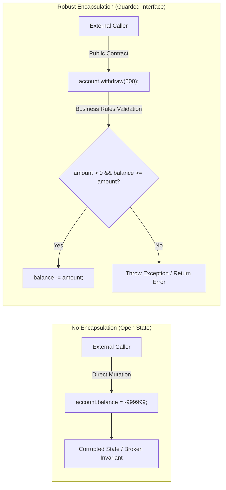
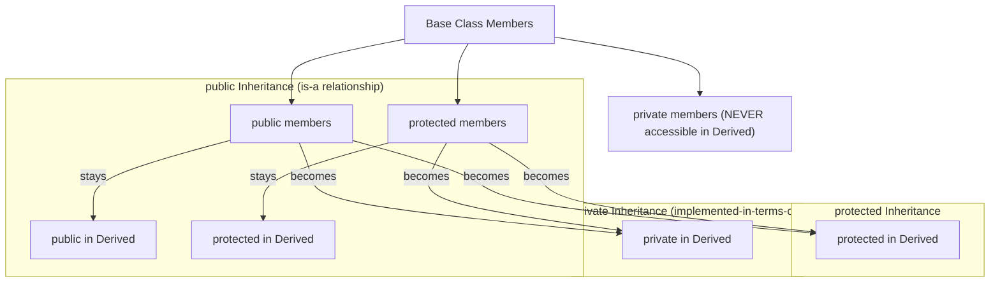

# Comprehensive Deep-Dive: Encapsulation & Access Modifiers
### An Architectural, Semantic, and Implementation Comparison between C++ and Java

---

## Table of Contents
1. [Core Philosophy & Theoretical Foundations of Encapsulation](#1-core-philosophy--theoretical-foundations-of-encapsulation)
   - [Encapsulation vs. Data Hiding](#encapsulation-vs-data-hiding)
   - [The Role of Invariants](#the-role-of-invariants)
   - [The "Tell, Don't Ask" Principle & Anemic Domain Models](#the-tell-dont-ask-principle--anemic-domain-models)
2. [Encapsulation in Java](#2-encapsulation-in-java)
   - [Implementation & Invariant Enforcement](#java-implementation--invariant-enforcement)
   - [The Danger of Leaking Internal References (Defensive Copying)](#the-danger-of-leaking-internal-references-defensive-copying)
   - [Modern Java: Immutable Records (`record`)](#modern-java-immutable-records-record)
3. [Encapsulation in C++](#3-encapsulation-in-c)
   - [Implementation & Invariant Enforcement](#c-implementation--invariant-enforcement)
   - [Deep Dive: `const` Member Functions & `const`-Correctness](#deep-dive-const-member-functions--const-correctness)
   - [Physical vs Logical Constness & The `mutable` Keyword](#physical-vs-logical-constness--the-mutable-keyword)
   - [Reference Leaks: Dangling References vs `const` Reference Exposure](#reference-leaks-dangling-references-vs-const-reference-exposure)
4. [C++ `struct` vs `class`: The Full Architectural Truth](#4-c-struct-vs-class-the-full-architectural-truth)
   - [The Real Differences: Defaults Only](#the-real-differences-defaults-only)
   - [Under-the-Hood Memory Layout Comparison](#under-the-hood-memory-layout-comparison)
   - [Idiomatic Conventions: When to Use `struct` vs `class`](#idiomatic-conventions-when-to-use-struct-vs-class)
5. [Access Modifiers in Java](#5-access-modifiers-in-java)
   - [The 4-Tier Access Matrix](#the-4-tier-access-matrix)
   - [The Cross-Package `protected` Trap (A Critical JVM Rule)](#the-cross-package-protected-trap-a-critical-jvm-rule)
   - [Package-Private (Default) Visibility as an Architectural Boundary](#package-private-default-visibility-as-an-architectural-boundary)
6. [Access Modifiers in C++](#6-access-modifiers-in-c)
   - [The 3 Access Specifiers](#the-3-access-specifiers)
   - [Inheritance Access Specifiers: `public`, `protected`, and `private` Inheritance](#inheritance-access-specifiers-public-protected-and-private-inheritance)
7. [Controlled Encapsulation Breaches](#7-controlled-encapsulation-breaches)
   - [C++ `friend` Classes and Functions](#c-friend-classes-and-functions)
   - [Java Reflection (`setAccessible`) vs Java Module System (JPMS)](#java-reflection-setaccessible-vs-java-module-system-jpms)
8. [Summary & Best Practices Checklist](#8-summary--best-practices-checklist)

---

## 1. Core Philosophy & Theoretical Foundations of Encapsulation

**Encapsulation** is the foundational pillar of Object-Oriented Software Engineering. It is defined as:
> **The bundling of state (attributes) and operations (methods) into a single self-contained cohesive unit, coupled with strict boundary controls preventing unauthorized or direct external modification of that internal state.**



### Encapsulation vs. Data Hiding
Although often used interchangeably in casual conversation, they represent distinct concepts:
* **Data Hiding**: A specific security/containment mechanism that hides internal variables using access modifiers (`private`). It restricts scope visibility.
* **Encapsulation**: The broader architectural principle of bundling data with logic, protecting **invariants**, and providing a meaningful abstraction to callers. You can hide data without properly encapsulating an object (e.g., generating brainless public getters and setters for every private field).

### The Role of Invariants
An **Invariant** is a condition or rule that must always hold true for an object throughout its entire lifetime (from the moment construction finishes until destruction).
- *Example Invariant 1*: A bank account balance must never fall below zero (or an overdraft limit).
- *Example Invariant 2*: A date object must never represent February 30th.
- *Example Invariant 3*: A network connection handle must point to an open OS socket if `isConnected == true`.

If client code can reach inside and do:
```cpp
account.balance = -100000; // Directly bypassing checks!
```
the invariant is broken, and the system enters an undefined, inconsistent state. Encapsulation guarantees that **the object alone is the sole authority governing its invariants**.

### The "Tell, Don't Ask" Principle & Anemic Domain Models
A frequent anti-pattern is creating an **Anemic Domain Model**:
```java
// Anti-pattern: Procedural code masquerading as OOP
account.setBalance(account.getBalance() - 500);
```
Here, the caller "asks" for the balance, computes the logic externally, and "sets" it back. This strips the object of its behavioral responsibility.

Encapsulation mandates **Tell, Don't Ask**:
```java
// Encapsulated: Tell the object what business operation to perform
account.withdraw(500);
```
The object handles checks, concurrency synchronization, auditing, state transitions, and event dispatches internally.

---

## 2. Encapsulation in Java

Java enforces encapsulation at the bytecode and JVM verifier level. Field access checks are validated at compile time by `javac` and verified at runtime by the JVM ClassLoader and Verifier.

### Java Implementation & Invariant Enforcement

```java
package com.banking.domain;

public class BankAccount {
    // 1. Private fields: Complete physical data hiding
    private final String accountNumber;
    private double balance;
    private boolean isFrozen;

    // 2. Constructor enforces initialization invariants
    public BankAccount(String accountNumber, double initialDeposit) {
        if (accountNumber == null || accountNumber.trim().isEmpty()) {
            throw new IllegalArgumentException("Account number cannot be null or blank.");
        }
        if (initialDeposit < 0.0) {
            throw new IllegalArgumentException("Initial deposit cannot be negative. Provided: " + initialDeposit);
        }
        this.accountNumber = accountNumber;
        this.balance = initialDeposit;
        this.isFrozen = false;
    }

    // 3. Mutator methods enforce state transition invariants
    public void deposit(double amount) {
        ensureAccountActive();
        if (amount <= 0.0) {
            throw new IllegalArgumentException("Deposit amount must be strictly positive. Provided: " + amount);
        }
        this.balance += amount;
    }

    public void withdraw(double amount) {
        ensureAccountActive();
        if (amount <= 0.0) {
            throw new IllegalArgumentException("Withdrawal amount must be strictly positive. Provided: " + amount);
        }
        if (amount > this.balance) {
            throw new IllegalStateException(
                String.format("Insufficient funds. Requested: %.2f, Available: %.2f", amount, this.balance)
            );
        }
        this.balance -= amount;
    }

    // 4. Safe Read-Only Access
    public double getBalance() {
        return this.balance;
    }

    public String getAccountNumber() {
        return this.accountNumber;
    }

    public boolean isFrozen() {
        return this.isFrozen;
    }

    // 5. Internal private helper: Encapsulating validation logic
    private void ensureAccountActive() {
        if (this.isFrozen) {
            throw new IllegalStateException("Account " + accountNumber + " is frozen. Transactions prohibited.");
        }
    }
}
```

#### Client Usage
```java
public class Main {
    public static void main(String[] args) {
        BankAccount account = new BankAccount("ACC-90412", 5000.0);

        account.deposit(1000.0);
        System.out.println("Balance: " + account.getBalance()); // 6000.0

        // COMPILATION ERROR: balance has private access in BankAccount
        // account.balance = -50000;

        // RUNTIME VALIDATION ERROR: Throws IllegalArgumentException
        // account.deposit(-200);

        // RUNTIME INSUFFICIENT FUNDS ERROR: Throws IllegalStateException
        // account.withdraw(10000);
    }
}
```

---

### The Danger of Leaking Internal References (Defensive Copying)

A critical vulnerability in object encapsulation occurs when returning or accepting references to **mutable** objects (such as `java.util.Date`, arrays, or collections):

```java
// BROKEN ENCAPSULATION VULNERABILITY
public class UserProfile {
    private String username;
    private java.util.Date dateOfBirth; // Mutable class!

    public UserProfile(String username, java.util.Date dob) {
        this.username = username;
        this.dateOfBirth = dob; // DANGER: Direct reference assignment!
    }

    public java.util.Date getDateOfBirth() {
        return this.dateOfBirth; // DANGER: Leaks internal reference!
    }
}
```

#### How External Code Destroys Encapsulation:
```java
Date myDob = new Date(95, 4, 15);
UserProfile profile = new UserProfile("alice", myDob);

// Breach 1: External caller mutates original object
myDob.setYear(50); // Mutates profile's internal birth year secretly!

// Breach 2: Getter caller mutates internal state
profile.getDateOfBirth().setYear(20); // Internal state corrupted externally!
```

#### The Solution: Defensive Copying
```java
public class SecureUserProfile {
    private final String username;
    private final java.util.Date dateOfBirth;

    public SecureUserProfile(String username, java.util.Date dob) {
        this.username = username;
        // Defensive Copy on ingestion:
        this.dateOfBirth = new java.util.Date(dob.getTime());
    }

    public java.util.Date getDateOfBirth() {
        // Defensive Copy on access:
        return new java.util.Date(this.dateOfBirth.getTime());
    }
}
```

---

### Modern Java: Immutable Records (`record`)

Introduced in Java 14+ (finalized in Java 16), `record` provides compiler-enforced immutable encapsulation for pure data carriers:

```java
public record CurrencyAmount(double amount, String currencyCode) {
    // Compact constructor for validation invariants
    public CurrencyAmount {
        if (amount < 0) {
            throw new IllegalArgumentException("Amount cannot be negative: " + amount);
        }
        if (currencyCode == null || currencyCode.length() != 3) {
            throw new IllegalArgumentException("Invalid ISO currency code: " + currencyCode);
        }
    }
}
```
All fields in a Java record are implicitly `private final`. No setters are generated, and accessor methods match the attribute names directly (`amount()` and `currencyCode()`).

---

## 3. Encapsulation in C++

C++ enforces encapsulation strictly at compile time. At runtime, access modifiers have **zero execution overhead** and do not exist in machine assembly.

### C++ Implementation & Invariant Enforcement

```cpp
#include <iostream>
#include <string>
#include <stdexcept>

class BankAccount {
private:
    // Attributes hidden behind private boundary
    std::string accountNumber;
    double balance;
    bool isFrozen;

    // Private helper function
    void ensureActive() const {
        if (isFrozen) {
            throw std::logic_error("Account is frozen. Transactions prohibited.");
        }
    }

public:
    // Constructor initializes invariants
    BankAccount(std::string accNum, double initialBalance)
        : accountNumber(std::move(accNum)), balance(initialBalance), isFrozen(false) {
        if (accountNumber.empty()) {
            throw std::invalid_argument("Account number cannot be empty.");
        }
        if (balance < 0.0) {
            throw std::invalid_argument("Initial balance cannot be negative.");
        }
    }

    // Mutating member functions (cannot be const)
    void deposit(double amount) {
        ensureActive();
        if (amount <= 0.0) {
            throw std::invalid_argument("Deposit amount must be strictly positive.");
        }
        balance += amount;
    }

    void withdraw(double amount) {
        ensureActive();
        if (amount <= 0.0) {
            throw std::invalid_argument("Withdrawal amount must be strictly positive.");
        }
        if (amount > balance) {
            throw std::runtime_error("Insufficient funds for withdrawal.");
        }
        balance -= amount;
    }

    // Const member functions: Encapsulation promises read-only access
    double getBalance() const {
        return balance;
    }

    const std::string& getAccountNumber() const {
        return accountNumber;
    }

    bool getIsFrozen() const {
        return isFrozen;
    }
};
```

---

### Deep Dive: `const` Member Functions & `const`-Correctness

In C++, appending `const` to a member function declaration is a foundational pillar of encapsulation known as **`const`-correctness**:

```cpp
double getBalance() const;
```

#### What does `const` after a function signature actually mean?
Inside any normal member function of `BankAccount`, the implicit `this` pointer has the type:
```cpp
BankAccount* const this; // Constant pointer to a mutable BankAccount
```
When you declare a member function as `const`:
```cpp
const BankAccount* const this; // Constant pointer to a CONSTANT BankAccount
```
This means:
1. The compiler **strictly forbids** modifying any member variable inside that method (e.g., `balance = 0;` will fail compilation).
2. The function guarantees to all callers that invoking it will **not mutate the observable state** of the object.
3. Only `const` member functions can be called on `const` object instances:

```cpp
void printAccountSummary(const BankAccount& account) {
    // Valid: getBalance() is const
    std::cout << "Balance: " << account.getBalance() << "\n";

    // COMPILE ERROR: deposit() is non-const!
    // account.deposit(50.0);
}
```

---

### Physical vs Logical Constness & The `mutable` Keyword

C++ distinguishes between:
* **Physical (Bitwise) Constness**: Every single byte of the object's memory is unchanged.
* **Logical (Conceptual) Constness**: The object's user-facing state and behavior remain unchanged, but internal machinery (such as caching, telemetry counters, or thread synchronization mutexes) may change.

If a `const` member function needs to update an internal cache or acquire a thread lock, it cannot modify regular fields. The **`mutable`** keyword solves this without breaking conceptual encapsulation:

```cpp
#include <mutex>
#include <string>

class ThreadSafeMetrics {
private:
    double cachedValue;
    
    // Marked mutable: Can be legally modified even within const member functions
    mutable int accessCounter;
    mutable std::mutex stateMutex;

public:
    ThreadSafeMetrics(double val) : cachedValue(val), accessCounter(0) {}

    double readValue() const {
        // Locking the mutex alters its internal state, allowed because it's mutable
        std::lock_guard<std::mutex> lock(stateMutex);
        
        // Updating telemetry counter inside a const method!
        ++accessCounter; 

        return cachedValue;
    }

    int getReadCount() const {
        std::lock_guard<std::mutex> lock(stateMutex);
        return accessCounter;
    }
};
```

---

### Reference Leaks: Dangling References vs `const` Reference Exposure

In C++, developers can expose private fields by returning references. Done incorrectly, this breaks encapsulation completely:

```cpp
// ANTI-PATTERN: Leaking private state via non-const reference
class Vault {
private:
    int secretKey;
public:
    Vault(int key) : secretKey(key) {}

    int& getSecretKey() { // RETURNS NON-CONST REFERENCE!
        return secretKey;
    }
};

Vault v(12345);
int& ref = v.getSecretKey();
ref = 99999; // ENCAPSULATION SHATTERED! secretKey mutated externally without Vault knowing!
```

#### The Idiomatic C++ Encapsulation Pattern:
Return either:
1. **By Value**: `int getSecretKey() const` (Safe, fast for small primitives).
2. **By `const` Reference**: `const std::string& getName() const` (Prevents mutation, avoids copying large objects).

---

## 4. C++ `struct` vs `class`: The Full Architectural Truth

A common misconception among beginner and intermediate programmers is that `struct` in C++ is just like a C struct (only holding data without methods or constructors).

### The Real Differences: Defaults Only
In C++, a `struct` is **identical to a `class` in every capability**. A `struct` can have:
- Constructors, Destructors, Virtual Functions
- Private, Protected, and Public sections
- Inheritance, Templates, Operator Overloads

There are **only two syntactic differences** defined by the ISO C++ standard:

| Feature | `class` | `struct` |
| :--- | :--- | :--- |
| **Default Member Access** | `private` | `public` |
| **Default Base Class Inheritance** | `private` inheritance | `public` inheritance |

```cpp
// 1. Member Access Default:
class ClassExample {
    int x; // PRIVATE by default
};

struct StructExample {
    int x; // PUBLIC by default
};

// 2. Inheritance Default:
class Base {};

class DerivedClass : Base {};  // Inherits Base PRIVATELY by default
struct DerivedStruct : Base {}; // Inherits Base PUBLICLY by default
```

Everything else is identical:
```cpp
// Valid and legal C++:
struct AdvancedStruct {
private:
    int hiddenVal;

public:
    AdvancedStruct(int v) : hiddenVal(v) {}
    virtual ~AdvancedStruct() = default;

    virtual void compute() {
        std::cout << "Struct computing: " << hiddenVal << "\n";
    }
};
```

---

### Under-the-Hood Memory Layout Comparison

Does a `struct` consume less memory than a `class`? **No.**

```cpp
struct PointStruct {
    int x;
    int y;
};

class PointClass {
public:
    PointClass(int x, int y) : x(x), y(y) {}
    int getX() const { return x; }
    int getY() const { return y; }
private:
    int x;
    int y;
};
```

#### Compiler Assembly & Memory Layout:
```
PointStruct:
Offset 0: int x (4 bytes)
Offset 4: int y (4 bytes)
Total Size = 8 bytes.

PointClass:
Offset 0: int x (4 bytes)
Offset 4: int y (4 bytes)
Total Size = 8 bytes.
```
At the machine level, the compiler generates the **exact same byte layout, padding, and assembly instructions** for both. Access modifiers exist only during compile-time symbol resolution.

---

### Idiomatic Conventions: When to Use `struct` vs `class`

In modern industry C++ (Google C++ Style Guide, C++ Core Guidelines):

1. **Use `struct` for Passive Data (Data Transfer Objects / Aggregates)**:
   - When all member variables can be modified freely without violating invariants.
   - For mathematical coordinates, RGB colors, configuration settings packets, and tuples.
   - For Functors and Template Type Traits (e.g., `std::less<T>`, `std::hash<T>`).
2. **Use `class` for Encapsulated Entities with Invariants**:
   - When data members must be guarded behind `private`.
   - When methods enforce state transition rules, caching, or life-cycle management.
   - For polymorphic hierarchies with virtual functions.

---

## 5. Access Modifiers in Java

Java provides four levels of access control to manage visibility across classes, packages, and inheritance trees.

### The 4-Tier Access Matrix

| Modifier | Same Class | Same Package | Subclass (Outside Package) | Universal World |
| :--- | :---: | :---: | :---: | :---: |
| `public` |  |  |  |  |
| `protected` |  |  | ⚠️ *(With constraint)* | ❌ |
| *default* (no modifier) |  |  | ❌ | ❌ |
| `private` |  | ❌ | ❌ | ❌ |

---

### The Cross-Package `protected` Trap (A Critical JVM Rule)

Many developers believe `protected` means "any subclass anywhere can access this member." **This is incomplete and leads to unexpected compilation errors.**

#### The Exact Rule:
> A subclass in a different package can access a `protected` member of its superclass **only through references of its own subclass type (or one of its own subclasses)**, NOT through a direct reference to the parent superclass or a sibling subclass.

#### Code Demonstration of the Trap:

```java
// File: packageA/Parent.java
package packageA;

public class Parent {
    protected int protectedValue = 42;
}
```

```java
// File: packageB/Child.java
package packageB;
import packageA.Parent;

public class Child extends Parent {
    
    public void testAccess() {
        // 1. Legal: Accessed through 'this' (implicit subclass instance)
        System.out.println(this.protectedValue); 

        // 2. Legal: Accessed through an instance of Child
        Child c = new Child();
        System.out.println(c.protectedValue); 

        // 3. ILLEGAL! COMPILE ERROR!
        Parent p = new Parent();
        // System.out.println(p.protectedValue); 
        // ERROR: protectedValue has protected access in packageA.Parent

        // 4. ILLEGAL! COMPILE ERROR!
        // Sibling sibling = new Sibling(); // where Sibling also extends Parent
        // System.out.println(sibling.protectedValue);
    }
}
```

#### Why does Java enforce this?
If `Child` could access `protectedValue` directly through an arbitrary `Parent` reference, any external package could subclass `Parent` simply to pry open and manipulate other unrelated instances of `Parent`, completely undermining encapsulation!

---

### Package-Private (Default) Visibility as an Architectural Boundary

In Java, omitting an access modifier gives **Package-Private** (default) access.
- It is visible to every class within the **exact same package directory**, but invisible to subpackages or outside packages.
- **Architectural Value**: It is ideal for internal component libraries. You can expose a clean `public` interface while keeping five helper classes and implementations package-private. External users only see the interface, preventing unwanted couplings.

---

## 6. Access Modifiers in C++

C++ uses labeled access specifiers within the class definition.

### The 3 Access Specifiers
* `public`: Visible to all callers.
* `protected`: Visible to the declaring class, derived classes, and `friend` entities. (C++ has no concept of "package" access).
* `private`: Visible only to the declaring class and its `friend` entities.

---

### Inheritance Access Specifiers: `public`, `protected`, and `private` Inheritance

Unlike Java (where inheritance is always public: `class Dog extends Animal`), C++ allows you to specify the **inheritance access modifier**:

```cpp
class Derived : [access-specifier] Base {};
```

The inheritance access specifier sets the **maximum visibility** that inherited members can have in the derived class:



#### Comparison Matrix:

| Member in Base | Inherited via `public` | Inherited via `protected` | Inherited via `private` |
| :--- | :--- | :--- | :--- |
| `public` | **`public`** | **`protected`** | **`private`** |
| `protected` | **`protected`** | **`protected`** | **`private`** |
| `private` | **Inaccessible** | **Inaccessible** | **Inaccessible** |

#### Why would you use Private Inheritance?
Private inheritance models **"is implemented in terms of"** rather than "is-a". It is an encapsulation tool: the derived class reuses the base class's code and can override virtual functions, but **no external client can cast `Derived*` to `Base*`**:

```cpp
class Engine {
public:
    void startPistons() {}
};

class Car : private Engine { // Car is NOT an Engine, but uses Engine internally
public:
    void drive() {
        startPistons(); // Accessible internally
    }
};

Car myCar;
// myCar.startPistons(); // COMPILE ERROR: private inheritance hides Base interface!
```

---

## 7. Controlled Encapsulation Breaches

### C++ `friend` Classes and Functions
In C++, a class can selectively grant full access to its private and protected members to designated external functions or classes using the `friend` keyword:

```cpp
class Matrix;

class Vector {
private:
    double elements[4];

    // Grants Matrix full access to elements
    friend class Matrix;
    
    // Grants stream operator access to private elements
    friend std::ostream& operator<<(std::ostream& os, const Vector& v);
};

std::ostream& operator<<(std::ostream& os, const Vector& v) {
    os << "[" << v.elements[0] << ", " << v.elements[1] << "]";
    return os;
}
```

#### Encapsulation Philosophy of `friend`:
- `friend` declarations do **not** destroy encapsulation when used intentionally; they **enhance** it. Without `friend`, a developer would be forced to make internal details `public` to the entire world just so a specific operator or closely related companion class could interact with it.
- **Rule**: Friendship is **neither inherited nor transitive**. (If A is a friend of B, and B is a friend of C, A is NOT a friend of C).

---

### Java Reflection (`setAccessible`) vs Java Module System (JPMS)

Historically in Java, encapsulation could be breached at runtime using Reflection:

```java
// Traditional Java Reflection Hack
Field balanceField = BankAccount.class.getDeclaredField("balance");
balanceField.setAccessible(true); // Bypasses private modifier!
balanceField.set(account, -999999.0); // Mutated private field!
```

#### Modern Defense: Java 9+ Module System (JPMS)
Under the Module System (`module-info.java`), Java introduced **Strong Encapsulation**:
- Packages are private to a module by default.
- Even if a class or field is `public`, it cannot be accessed outside its module unless explicitly `exports`-ed.
- Reflection via `setAccessible(true)` on non-exported or non-opened packages causes a runtime `InaccessibleObjectException`:

```java
module com.banking.security {
    // Only exported packages can be imported
    exports com.banking.domain;

    // Reflection is blocked unless explicitly 'opens' is declared
    opens com.banking.internal to com.framework.orm; 
}
```

---

## 8. Summary & Best Practices Checklist

| Best Practice / Principle | C++ Approach | Java Approach |
| :--- | :--- | :--- |
| **Default Member Access** | Keep all attributes `private`. | Keep all attributes `private`. |
| **Data Transfer Objects** | Use `struct` for pure passive data (POD). | Use `record` for immutable data carriers. |
| **Read-Only Guarantees** | Mark accessors with `const` (`double get() const;`). | Return copies of mutable objects or unmodifiable collections. |
| **Leaking Internals** | Return by value or `const&`. Never return non-const `&` or raw `*` to private state. | Perform **Defensive Copying** on both ingestion and access for mutable fields. |
| **Inter-Class Coupling** | Use `friend` sparingly for operators and companion builders. | Use package-private visibility to hide helper classes within the package. |
| **State Validation** | Validate in constructors; throw exceptions or return error types. | Validate in constructors; throw `IllegalArgumentException`. |
