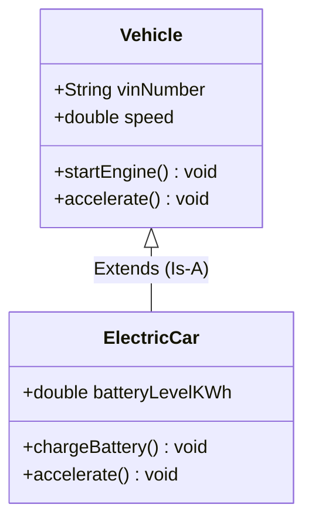
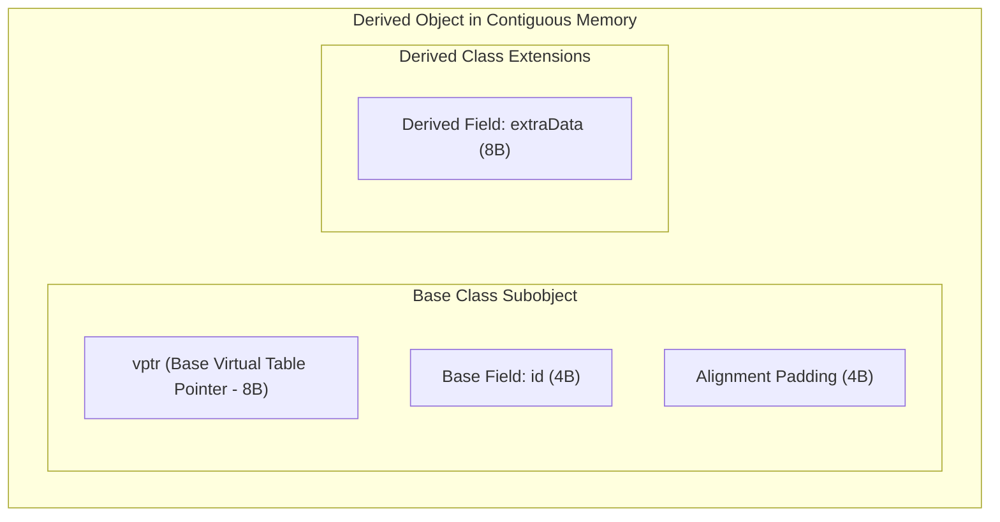
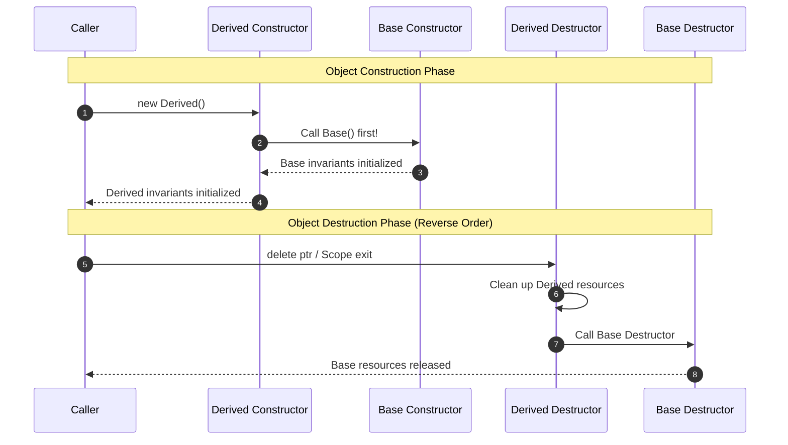
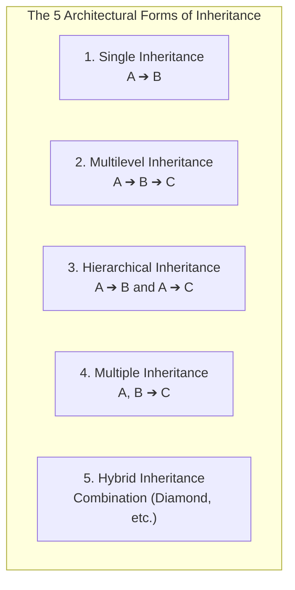
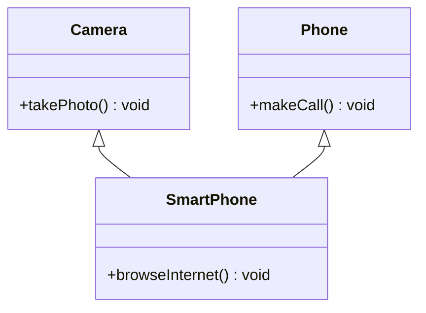
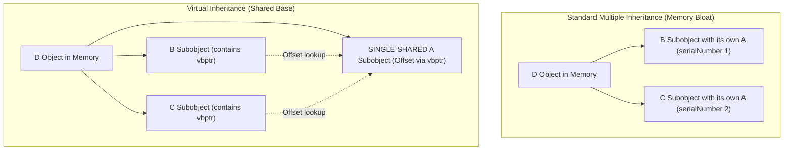

# Comprehensive Deep-Dive: Inheritance & The Diamond Problem
### An Architectural, Memory-Model, and Implementation Comparison between C++ and Java

---

## Table of Contents
1. [Core Philosophy & Theoretical Foundations of Inheritance](#1-core-philosophy--theoretical-foundations-of-inheritance)
   - [What is Inheritance?](#what-is-inheritance)
   - [Why Do We Need It? (Code Reuse vs Subtyping Polymorphism)](#why-do-we-need-it-code-reuse-vs-subtyping-polymorphism)
   - [The Liskov Substitution Principle (LSP)](#the-liskov-substitution-principle-lsp)
   - [Inheritance ("Is-A") vs Composition ("Has-A")](#inheritance-is-a-vs-composition-has-a)
2. [Under-the-Hood Mechanics & Memory Layouts](#2-under-the-hood-mechanics--memory-layouts)
   - [Subobject Composition in Memory](#subobject-composition-in-memory)
   - [Construction and Destruction Call Sequences](#construction-and-destruction-call-sequences)
   - [The Hidden Compiler Cost: Pointer Adjustments (`this` Shifting)](#the-hidden-compiler-cost-pointer-adjustments-this-shifting)
3. [Taxonomy: The 5 Types of Inheritance](#3-taxonomy-the-5-types-of-inheritance)
   - [1. Single Inheritance](#1-single-inheritance)
   - [2. Multilevel Inheritance](#2-multilevel-inheritance)
   - [3. Hierarchical Inheritance](#3-hierarchical-inheritance)
   - [4. Multiple Inheritance](#4-multiple-inheritance)
   - [5. Hybrid (Multipath) Inheritance](#5-hybrid-multipath-inheritance)
4. [The Diamond Problem: Complete Architecture & Resolution](#4-the-diamond-problem-complete-architecture--resolution)
   - [The Core Dilemma: Ambiguity and Memory Bloat](#the-core-dilemma-ambiguity-and-memory-bloat)
   - [C++ Solution: Virtual Inheritance & The `vbptr`](#c-solution-virtual-inheritance--the-vbptr)
   - [Java Solution: Class Ban & Interface Default Method Rules](#java-solution-class-ban--interface-default-method-rules)
5. [Java Interfaces vs C++ Abstract Base Classes](#5-java-interfaces-vs-c-abstract-base-classes)
   - [Syntactic and Semantic Differences](#syntactic-and-semantic-differences)
   - [Interface Evolution: Default and Static Methods (Java 8+)](#interface-evolution-default-and-static-methods-java-8)
   - [Multiple Interface Implementation in Java](#multiple-interface-implementation-in-java)
6. [Critical Pitfalls, Edge Cases & Low-Level Traps](#6-critical-pitfalls-edge-cases--low-level-traps)
   - [Object Slicing in C++](#object-slicing-in-c)
   - [The Fragile Base Class Problem](#the-fragile-base-class-problem)
   - [Preventing Inheritance: `final` in Java vs C++](#preventing-inheritance-final-in-java-vs-c)
   - [Covariant Return Types](#covariant-return-types)
7. [Comprehensive Comparison Matrix: C++ vs Java](#7-comprehensive-comparison-matrix-c-vs-java)

---

## 1. Core Philosophy & Theoretical Foundations of Inheritance

### What is Inheritance?
**Inheritance** is a fundamental mechanism of Object-Oriented Programming where a new class (known as the **Derived**, **Child**, or **Subclass**) is defined based upon an existing class (known as the **Base**, **Parent**, or **Superclass**).

The derived class automatically acquires the attributes (state) and methods (behavior) of the base class, with the capability to:
1. **Extend**: Introduce new attributes and specialized methods.
2. **Override**: Substitute new implementations for polymorphic base methods.
3. **Restrict/Specialize**: Narrow the scope of valid operations to maintain stricter invariants.



### Why Do We Need It? (Code Reuse vs Subtyping Polymorphism)
Beginners frequently believe inheritance exists purely for **code reuse** (to avoid typing the same fields twice). While code reuse is a benefit, modern software engineering treats it as a secondary side effect.

The primary architectural purpose of inheritance is **Subtyping Polymorphism**:
> Enabling a client subsystem to interact with a multitude of diverse derived objects through a uniform base class interface, without knowing or caring about their concrete types at compile time.

```java
// Subtyping Polymorphism in action:
// The processPayment system does NOT care whether it's CreditCard, Crypto, or PayPal
public void processPayment(PaymentGateway gateway, double amount) {
    gateway.authorize(amount); // Late-bound dynamic dispatch!
}
```

### The Liskov Substitution Principle (LSP)
Formulated by Barbara Liskov in 1987, the **Liskov Substitution Principle** is the golden standard for correct inheritance:
> *Let $\phi(x)$ be a property provable about objects $x$ of type $T$. Then $\phi(y)$ should be true for objects $y$ of type $S$ where $S$ is a subtype of $T$.*

**In Plain Terms**:
If class `B` inherits from class `A`, you must be able to replace any instance of `A` with an instance of `B` without breaking the program, violating assumptions, or throwing unexpected exceptions.

#### The Classic Violation: The Square-Rectangle Problem
```cpp
class Rectangle {
protected:
    int width, height;
public:
    virtual void setWidth(int w) { width = w; }
    virtual void setHeight(int h) { height = h; }
    int getArea() const { return width * height; }
};

// Mathematically, a Square is a Rectangle.
// In OOP, a Square breaks Rectangle's behavioral invariants!
class Square : public Rectangle {
public:
    void setWidth(int w) override { width = height = w; }
    void setHeight(int h) override { width = height = h; }
};

void verifyArea(Rectangle& r) {
    r.setWidth(5);
    r.setHeight(4);
    // For any true Rectangle, 5 * 4 = 20.
    // But if a Square is passed in, area is 4 * 4 = 16!
    assert(r.getArea() == 20); // FAILS! LSP VIOLATION!
}
```
**Takeaway**: In OOP, inheritance models **behavioral compatibility**, not merely real-world taxonomic classification.

### Inheritance ("Is-A") vs Composition ("Has-A")
The celebrated GoF (Gang of Four) principle states:
> *"Favor object composition over class inheritance."*

| Dimension | Inheritance ("Is-A") | Composition ("Has-A") |
| :--- | :--- | :--- |
| **Coupling** | **Tight / White-Box**: Derived class is exposed to base class implementation details. | **Loose / Black-Box**: Component objects interact solely through public interfaces. |
| **Flexibility** | **Static**: Decided at compile time. Cannot change the parent of an object at runtime. | **Dynamic**: Can swap out internal strategies or components at runtime. |
| **Fragility** | Changes in the base class can silently break subclasses (**Fragile Base Class** problem). | Encapsulation remains completely intact. |
| **When to Use** | When true polymorphic substitution (LSP) is required and the child truly *is* a specialized parent. | When reusing functionality or assembling complex behaviors from smaller parts. |

---

## 2. Under-the-Hood Mechanics & Memory Layouts

### Subobject Composition in Memory
When you instantiate a derived class, the operating system does **not** allocate two independent objects. It allocates a single contiguous memory block that embeds the base class subobject within itself.



#### C++ Memory Layout Verification:
```cpp
class Base {
    int id; // 4 bytes
};

class Derived : public Base {
    double factor; // 8 bytes
};
```
- Total `sizeof(Derived)` = 16 bytes:
  - Offset `0` to `3`: `Base::id`
  - Offset `4` to `7`: Compiler alignment padding (to align `factor` to an 8-byte boundary)
  - Offset `8` to `15`: `Derived::factor`

### Construction and Destruction Call Sequences
Inheritance demands a strict, predictable initialization protocol to prevent accessing uninitialized memory:



#### The Immutable Golden Rule:
1. **Construction runs TOP-DOWN**: Base constructor executes **before** Derived constructor body.
2. **Destruction runs BOTTOM-UP**: Derived destructor executes **before** Base destructor body.

#### In Java:
```java
public class Base {
    public Base() { System.out.println("1. Base Init"); }
}
public class Derived extends Base {
    public Derived() {
        super(); // Implicitly added by javac if omitted! Must be the first statement.
        System.out.println("2. Derived Init");
    }
}
```

#### In C++:
```cpp
class Base {
public:
    Base() { std::cout << "1. Base Init\n"; }
    virtual ~Base() { std::cout << "4. Base Destroyed\n"; }
};

class Derived : public Base {
public:
    Derived() : Base() { std::cout << "2. Derived Init\n"; }
    ~Derived() override { std::cout << "3. Derived Destroyed\n"; }
};
```

---

### The Hidden Compiler Cost: Pointer Adjustments (`this` Shifting)
In C++ multiple inheritance, an object has **multiple base subobjects**.
Consider:
```cpp
class InterfaceA { public: int a; virtual void foo() {} };
class InterfaceB { public: int b; virtual void bar() {} };
class Derived : public InterfaceA, public InterfaceB { public: int c; };
```

#### The Memory Layout:
```
Derived Object:
[ Offset 0x00 ] InterfaceA Subobject (vptr_A + int a)
[ Offset 0x10 ] InterfaceB Subobject (vptr_B + int b)
[ Offset 0x20 ] Derived Field (int c)
```

Now watch what happens when you cast a pointer:
```cpp
Derived* d = new Derived();
InterfaceA* pA = d; // Address is identical: 0x1000
InterfaceB* pB = d; // Address is SHIFTED! 0x1010 (+16 bytes)
```
**Under the Hood**:
To call `pB->bar()`, the CPU must pass the `this` pointer pointing directly to the `InterfaceB` subobject! The compiler automatically injects an arithmetic addition (`add rdi, 16`) to the pointer when casting to `InterfaceB*`, and subtracts it when casting back to `Derived*`.
Java hides this completely because Java interfaces carry no fields and no direct class-memory offsets.

---

## 3. Taxonomy: The 5 Types of Inheritance



---

### 1. Single Inheritance
A derived class inherits directly from exactly one base class.

* **Where it is used**: Clean, straightforward specialization (e.g., `Employee -> Manager`).
* **Supported by**: Both C++ and Java natively.

#### C++ Implementation
```cpp
#include <iostream>
#include <string>

class Vehicle {
protected:
    std::string brand;
public:
    Vehicle(std::string b) : brand(std::move(b)) {}
    virtual void honk() const {
        std::cout << brand << " sounds horn: Beep beep!\n";
    }
    virtual ~Vehicle() = default;
};

class Car : public Vehicle {
private:
    int numberOfDoors;
public:
    Car(std::string b, int doors) 
        : Vehicle(std::move(b)), numberOfDoors(doors) {}

    void honk() const override {
        std::cout << brand << " (" << numberOfDoors << "-door car) sounds horn: Honk honk!\n";
    }
};
```

#### Java Implementation
```java
package com.inheritance.single;

class Vehicle {
    protected String brand;

    public Vehicle(String brand) {
        this.brand = brand;
    }

    public void honk() {
        System.out.println(brand + " sounds horn: Beep beep!");
    }
}

public class Car extends Vehicle {
    private final int numberOfDoors;

    public Car(String brand, int numberOfDoors) {
        super(brand); // Explicit call to base constructor
        this.numberOfDoors = numberOfDoors;
    }

    @Override
    public void honk() {
        System.out.println(brand + " (" + numberOfDoors + "-door car) sounds horn: Honk honk!");
    }
}
```

---

### 2. Multilevel Inheritance
A class is derived from another derived class, forming an inheritance chain: $A \rightarrow B \rightarrow C$.

* **Where it is used**: Progressive layer-by-layer domain refinement (e.g., `Device -> Computer -> Laptop`).
* **Supported by**: Both C++ and Java natively.

#### C++ Implementation
```cpp
#include <iostream>

class Device {
public:
    void powerOn() { std::cout << "Device powered on.\n"; }
};

class Computer : public Device {
public:
    void bootOS() { std::cout << "Operating system booted.\n"; }
};

class Laptop : public Computer {
public:
    void foldScreen() { std::cout << "Laptop screen folded.\n"; }
};

// Usage:
// Laptop myLaptop;
// myLaptop.powerOn();  // From Device
// myLaptop.bootOS();   // From Computer
// myLaptop.foldScreen(); // From Laptop
```

#### Java Implementation
```java
package com.inheritance.multilevel;

class Device {
    public void powerOn() {
        System.out.println("Device powered on.");
    }
}

class Computer extends Device {
    public void bootOS() {
        System.out.println("Operating system booted.");
    }
}

public class Laptop extends Computer {
    public void foldScreen() {
        System.out.println("Laptop screen folded.");
    }
}
```

---

### 3. Hierarchical Inheritance
Multiple child classes inherit from a single common parent class: $A \rightarrow B$ and $A \rightarrow C$.

* **Where it is used**: Building class families sharing a common ancestor (e.g., `Shape -> Circle`, `Shape -> Rectangle`, `Shape -> Triangle`).
* **Supported by**: Both C++ and Java natively.

#### C++ Implementation
```cpp
#include <iostream>

class Shape {
public:
    virtual double calculateArea() const = 0; // Pure virtual
    virtual ~Shape() = default;
};

class Circle : public Shape {
    double radius;
public:
    Circle(double r) : radius(r) {}
    double calculateArea() const override { return 3.14159 * radius * radius; }
};

class Rectangle : public Shape {
    double width, height;
public:
    Rectangle(double w, double h) : width(w), height(h) {}
    double calculateArea() const override { return width * height; }
};
```

#### Java Implementation
```java
package com.inheritance.hierarchical;

abstract class Shape {
    public abstract double calculateArea();
}

class Circle extends Shape {
    private final double radius;
    public Circle(double radius) { this.radius = radius; }

    @Override
    public double calculateArea() { return Math.PI * radius * radius; }
}

class Rectangle extends Shape {
    private final double width, height;
    public Rectangle(double width, double height) {
        this.width = width;
        this.height = height;
    }

    @Override
    public double calculateArea() { return width * height; }
}
```

---

### 4. Multiple Inheritance
A single derived class inherits directly from **two or more base classes**: $A, B \rightarrow C$.



* **Where it is used**: Composing an entity from independent behavioral capabilities (e.g., `SmartPhone` is both a `Camera` and a `Phone`).
* **Supported by**:
  - **C++**: Natively supports multiple inheritance of concrete classes.
  - **Java**: **Strictly forbids multiple inheritance of classes** (`class A extends B, C` causes a compile error). Java achieves multiple inheritance of *type and behavior* through **Interfaces**.

#### C++ Multiple Class Inheritance
```cpp
#include <iostream>

class Camera {
public:
    void takePhoto() { std::cout << "Click! Photo taken.\n"; }
};

class Phone {
public:
    void makeCall(const std::string& number) { 
        std::cout << "Dialing " << number << "...\n"; 
    }
};

// Multiple Inheritance: Inherits members from BOTH Camera and Phone
class SmartPhone : public Camera, public Phone {
public:
    void browseWeb(const std::string& url) {
        std::cout << "Navigating to " << url << "\n";
    }
};

void run() {
    SmartPhone sp;
    sp.takePhoto();           // From Camera
    sp.makeCall("555-0199");  // From Phone
    sp.browseWeb("openai.com"); // From SmartPhone
}
```

#### Java Multiple Interface Implementation
```java
package com.inheritance.multiple;

interface Camera {
    void takePhoto();
}

interface Phone {
    void makeCall(String number);
}

// Java uses 'implements' with multiple comma-separated interfaces
public class SmartPhone implements Camera, Phone {
    @Override
    public void takePhoto() {
        System.out.println("Click! Photo taken.");
    }

    @Override
    public void makeCall(String number) {
        System.out.println("Dialing " + number + "...");
    }

    public void browseWeb(String url) {
        System.out.println("Navigating to " + url);
    }
}
```

---

### 5. Hybrid (Multipath) Inheritance
Hybrid inheritance is a composite structure combining two or more inheritance patterns. Typically, it joins hierarchical and multiple inheritance, creating the infamous **Diamond Shape**:

```
        PoweredDevice (A)
         /             \
    Scanner (B)       Printer (C)
         \             /
        CopierMachine (D)
```

---

## 4. The Diamond Problem: Complete Architecture & Resolution

### The Core Dilemma: Ambiguity and Memory Bloat

Suppose class `A` has an attribute `int serialNumber` and a method `void powerOn()`.
Classes `B` and `C` both inherit from `A`.
Class `D` inherits from both `B` and `C`.

```
         A (serialNumber, powerOn)
        / \
       B   C
        \ /
         D
```

#### Dilemma 1: Memory Redundancy & State Duplication
Without intervention, an instance of `D` physically contains **two distinct `A` subobjects** in memory:
1. `D::B::A` (One copy of `serialNumber`)
2. `D::C::A` (A second copy of `serialNumber`)

If someone modifies `d.serialNumber`, which one is modified? The compiler throws:
`error: request for member 'serialNumber' is ambiguous`.

#### Dilemma 2: Method Dispatch Ambiguity
If `B` and `C` both override `powerOn()`, when calling:
```cpp
D d;
d.powerOn(); // WHICH METHOD RUNS? B::powerOn() or C::powerOn()?
```
The compiler cannot guess your intent.

---

### C++ Solution: Virtual Inheritance & The `vbptr`

C++ resolves this through **Virtual Base Classes** using the `virtual` keyword during inheritance:

```cpp
class B : virtual public A { ... };
class C : virtual public A { ... };
```

#### What `virtual` Inheritance Does at the Hardware/Memory Level:
Instead of embedding a copy of `A` inside `B` and another inside `C`, the compiler:
1. Stores **only one shared instance of `A`** at the very end of the `D` memory block.
2. Injects a hidden pointer called **`vbptr` (Virtual Base Pointer)** into both the `B` subobject and `C` subobject.
3. The `vbptr` points to a **Virtual Base Table (vbtable)** that stores the memory offset to find the single shared `A` subobject at runtime.



#### The Constructor Conundrum with Virtual Base Classes:
In standard inheritance, `B` initializes `A`, and `C` initializes `A`. But with virtual inheritance, having both initialize `A` would cause a collision!
**C++ Rule**:
> In virtual inheritance, **the most derived class (`D`) is responsible for directly invoking the virtual base class (`A`) constructor!** The calls to `A()` from `B` and `C` are completely ignored during the construction of `D`.

#### Complete C++ Diamond Problem Implementation
```cpp
#include <iostream>

class PoweredDevice {
public:
    int serialNumber;

    PoweredDevice(int sn) : serialNumber(sn) {
        std::cout << "PoweredDevice constructed with SN: " << serialNumber << "\n";
    }

    virtual void powerOn() const {
        std::cout << "Device powered on.\n";
    }

    virtual ~PoweredDevice() = default;
};

// Use 'virtual public' to ensure single shared instance of PoweredDevice
class Scanner : virtual public PoweredDevice {
public:
    Scanner(int sn) : PoweredDevice(sn) {
        std::cout << "Scanner initialized.\n";
    }

    void powerOn() const override {
        std::cout << "Scanner warming up optics.\n";
    }
};

// Use 'virtual public' here as well
class Printer : virtual public PoweredDevice {
public:
    Printer(int sn) : PoweredDevice(sn) {
        std::cout << "Printer cleaning print heads.\n";
    }

    void powerOn() const override {
        std::cout << "Printer warming up fuser.\n";
    }
};

// CopierMachine inherits from Scanner and Printer
class CopierMachine : public Scanner, public Printer {
public:
    // CRITICAL: CopierMachine MUST explicitly initialize the virtual base PoweredDevice!
    CopierMachine(int sn) 
        : PoweredDevice(sn), Scanner(sn), Printer(sn) {
        std::cout << "CopierMachine assembled.\n";
    }

    // Resolving Method Ambiguity:
    // Both Scanner and Printer override powerOn(). CopierMachine MUST explicitly override it!
    void powerOn() const override {
        // Disambiguate by explicitly calling the desired path, or combining them:
        Scanner::powerOn();
        Printer::powerOn();
        std::cout << "Copier ready to replicate!\n";
    }
};

int main() {
    CopierMachine copier(98765);
    
    // Unambiguous attribute access: Exactly ONE serialNumber exists!
    std::cout << "Copier SN: " << copier.serialNumber << "\n";

    copier.powerOn();
    return 0;
}
```

---

### Java Solution: Class Ban & Interface Default Method Rules

Java solves the Diamond Problem at the language design level through two architectures:

#### 1. Total Ban on Multiple Class Inheritance
Java **does not allow a class to extend more than one class**. This completely eliminates:
- Multiple copies of instance variables.
- Subobject memory offset shifts (`vbptr`).
- Constructor collision order.

#### 2. The Interface Diamond Problem (Java 8+)
Java 8 introduced `default` methods in interfaces. This brought the possibility of a diamond problem with method implementations:

```
        Interface A (default void log())
         /          \
  Interface B        Interface C
  (override log)     (override log)
         \          /
          Class D
```

If `B` and `C` both provide conflicting `default` implementations of `log()`, **Java refuses to compile class `D`** with the error:
`class D inherits unrelated defaults for log() from types B and C`.

#### How to Resolve the Interface Conflict in Java:
The implementing class `D` **must explicitly override** the conflicting method and specify which interface to delegate to using `InterfaceName.super.method()`:

```java
package com.diamond.solution;

interface PoweredDevice {
    default void powerOn() {
        System.out.println("Base device power on");
    }
}

interface Scanner extends PoweredDevice {
    @Override
    default void powerOn() {
        System.out.println("Scanner optics warmed up");
    }
}

interface Printer extends PoweredDevice {
    @Override
    default void powerOn() {
        System.out.println("Printer fuser heated");
    }
}

// Class D implements both interfaces
public class CopierMachine implements Scanner, Printer {

    // MANDATORY: Must override powerOn() to resolve conflict!
    @Override
    public void powerOn() {
        // Option 1: Choose Scanner's implementation
        // Scanner.super.powerOn();

        // Option 2: Choose Printer's implementation
        // Printer.super.powerOn();

        // Option 3: Call both explicitly
        Scanner.super.powerOn();
        Printer.super.powerOn();
        System.out.println("Copier ready to replicate!");
    }

    public static void main(String[] args) {
        CopierMachine copier = new CopierMachine();
        copier.powerOn();
    }
}
```

---

## 5. Java Interfaces vs C++ Abstract Base Classes

| Feature | Java Interface | C++ Abstract Base Class (ABC) |
| :--- | :--- | :--- |
| **Declaration** | `public interface Worker` | `class Worker { virtual void work() = 0; };` |
| **Instance Fields** | **Forbidden**. Only `public static final` constants. | **Allowed**. Can hold any instance variables. |
| **Inheritance Multiplicity**| A class can implement **unlimited** interfaces. | A class can inherit **unlimited** ABCs. |
| **Constructors** | **Forbidden**. Cannot have constructors. | **Allowed**. Has constructors to initialize fields. |
| **Method Implementation** | Supported via `default` and `static` methods. | Supported for any non-pure virtual or regular methods. |
| **Runtime Mechanism** | `invokeinterface` bytecode instruction. | Dynamic dispatch via `vptr` -> `vtable`. |

---

## 6. Critical Pitfalls, Edge Cases & Low-Level Traps

### Object Slicing in C++
A severe trap in C++ occurs when passing derived objects by **value** instead of by reference/pointer to a function expecting a base type:

```cpp
class Base {
public:
    int a = 1;
    virtual void print() const { std::cout << "Base: " << a << "\n"; }
};

class Derived : public Base {
public:
    int b = 2;
    void print() const override { std::cout << "Derived: " << a << ", " << b << "\n"; }
};

// TRAP: Parameter passed BY VALUE!
void display(Base obj) { 
    obj.print();
}

int main() {
    Derived d;
    display(d); // OBJECT SLICING OCCURS!
}
```

#### What happens during slicing?
1. The compiler copies **only the `Base` slice** of `d` into the new parameter `obj` using `Base`'s copy constructor.
2. The `Derived` slice (`int b`) is stripped off and discarded.
3. The new object's `vptr` is set to point to `Base`'s vtable.
4. Output: `Base: 1` instead of `Derived: 1, 2`!
*Java is immune to object slicing because Java variables are references; objects are never copied by value across method boundaries.*

---

### The Fragile Base Class Problem
The Fragile Base Class problem occurs when a seemingly harmless modification to a base class unintentionally breaks subclasses:

```java
public class CustomList extends ArrayList<String> {
    private int addCount = 0;

    @Override
    public boolean add(String s) {
        addCount++;
        return super.add(s);
    }

    @Override
    public boolean addAll(Collection<? extends String> c) {
        addCount += c.size();
        return super.addAll(c); // DANGER: What if ArrayList's internal addAll() calls add()?
    }

    public int getAddCount() { return addCount; }
}
```
If the underlying JDK implementation of `addAll` internally loops and calls `this.add()`, `addCount` gets **incremented twice** for every element!
*Solution*: Use Composition instead of Inheritance (`CustomList` wraps an `ArrayList` instance).

---

### Preventing Inheritance: `final` in Java vs C++

#### In Java:
```java
// 1. Prevents class inheritance:
public final class SecurityToken { ... }
// class HackToken extends SecurityToken {} // COMPILE ERROR!

// 2. Prevents method overriding:
public class Parent {
    public final void authenticate() { ... }
}
```

#### In C++ (C++11 Standard):
```cpp
// 1. Prevents class inheritance:
class SecurityToken final { ... };
// class HackToken : public SecurityToken {}; // COMPILE ERROR!

// 2. Prevents method overriding:
class Parent {
public:
    virtual void authenticate() final { ... }
};
```

---

### Covariant Return Types
Both C++ and Java allow an overriding method in a derived class to return a **more derived (more specific) pointer or reference type** than the method it overrides:

#### In C++:
```cpp
class AnimalProducer {
public:
    virtual Animal* create() { return new Animal(); }
};

class DogProducer : public AnimalProducer {
public:
    Dog* create() override { return new Dog(); } // Valid Covariant Return!
};
```

#### In Java:
```java
class AnimalProducer {
    public Animal create() { return new Animal(); }
}

class DogProducer extends AnimalProducer {
    @Override
    public Dog create() { return new Dog(); } // Valid Covariant Return!
}
```

---

## 7. Comprehensive Comparison Matrix: C++ vs Java

| Dimension | C++ Inheritance | Java Inheritance |
| :--- | :--- | :--- |
| **Class Inheritance Multiplicity** | Multiple (`class C : public A, public B`) | Single (`class C extends A`) |
| **Interface Multiplicity** | Multiple (Pure abstract classes) | Multiple (`implements I1, I2, I3`) |
| **Diamond Problem Resolution** | Virtual Base Classes (`virtual public`) | Disallowed for classes; explicit `Interface.super.method()` |
| **Access Control in Inheritance**| `public`, `protected`, and `private` inheritance | Always public inheritance (`extends`) |
| **Root of Hierarchy** | No universal root class | Every class inherits from `java.lang.Object` |
| **Destructor Dispatch** | Must be explicitly declared `virtual` | No destructors (managed by Garbage Collector) |
| **Object Slicing Risk** | High when passing base types by value | Non-existent (reference semantics) |
| **Subobject Pointer Shifting** | Yes (arithmetic adjustments on `this`) | No (references point to object headers) |
| **Inheritance Prevention** | `final` specifier (C++11) | `final` keyword |
| **Default Method Inheritance** | Concrete methods in base classes | `default` methods in interfaces |
