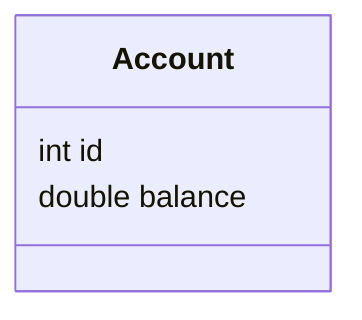
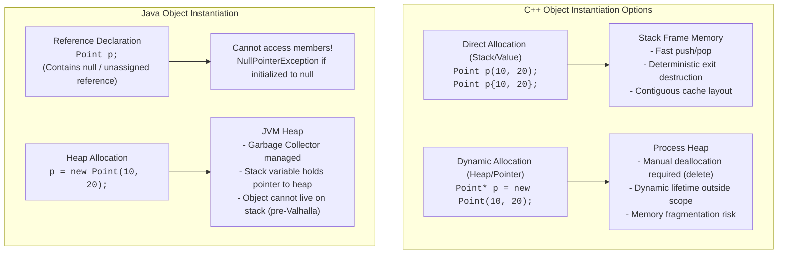
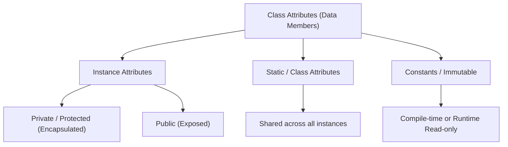
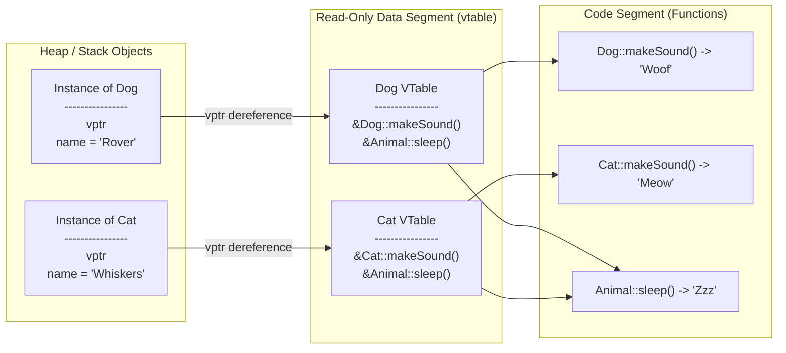
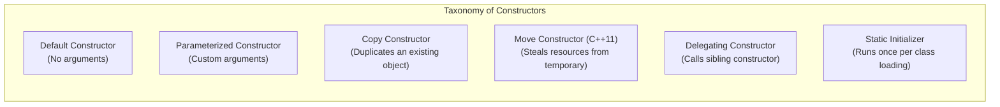
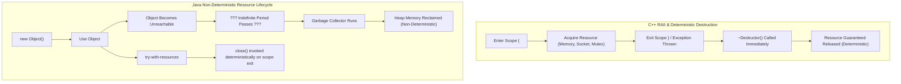

# Comprehensive Deep-Dive: Classes, Objects, Attributes, Methods, Constructors, and Destructors
### An Architectural, Implementation, and Memory-Model Comparison between C++ and Java

---

## Table of Contents
1. [Core Paradigms & Foundational Architecture](#1-core-paradigms--foundational-architecture)
2. [Classes: The Blueprint](#2-classes-the-blueprint)
   - [Definition & Conceptual Logic](#definition--conceptual-logic)
   - [Memory Footprint & Runtime Representation](#memory-footprint--runtime-representation)
   - [Syntax & Implementation Comparison](#syntax--implementation-comparison)
3. [Objects: The Concrete Entity](#3-objects-the-concrete-entity)
   - [Identity, State, and Behavior](#identity-state-and-behavior)
   - [Low-Level Memory Layout (C++ vs Java HotSpot JVM)](#low-level-memory-layout-c-vs-java-hotspot-jvm)
4. [Object Initialization Deep Dive: `new` vs Direct Stack Allocation](#4-object-initialization-deep-dive-new-vs-direct-stack-allocation)
   - [Direct Allocation (`Class obj;` / `Class obj{};`)](#direct-allocation-class-obj--class-obj)
   - [Heap Allocation via `new` (`Class* obj = new Class();`)](#heap-allocation-via-new-class-obj--new-class)
   - [The Java Perspective: Why `Class obj;` Does NOT Create an Object](#the-java-perspective-why-class-obj-does-not-create-an-object)
   - [The "Most Vexing Parse" Trap in C++](#the-most-vexing-parse-trap-in-c)
   - [Comprehensive Memory & Performance Comparison Matrix](#comprehensive-memory--performance-comparison-matrix)
5. [Attributes (Fields / Member Variables)](#5-attributes-fields--member-variables)
   - [Classification & Taxonomy](#classification--taxonomy)
   - [Access Modifiers & Encapsulation Semantics](#access-modifiers--encapsulation-semantics)
   - [Static vs Instance Attributes](#static-vs-instance-attributes)
   - [Const, Final, and Immutable Modifiers](#const-final-and-immutable-modifiers)
   - [Code Comparison](#code-comparison-attributes)
6. [Methods (Member Functions)](#6-methods-member-functions)
   - [Taxonomy of Methods](#taxonomy-of-methods)
   - [Overloading vs Overriding](#overloading-vs-overriding)
   - [Dispatch Mechanics: Early (Static) vs Late (Dynamic) Binding](#dispatch-mechanics-early-static-vs-late-dynamic-binding)
   - [The Virtual Method Table (vtable) in Action](#the-virtual-method-table-vtable-in-action)
   - [Code Comparison](#code-comparison-methods)
7. [Constructors: Object Genesis](#7-constructors-object-genesis)
   - [Taxonomy of Constructors](#taxonomy-of-constructors)
   - [Default Constructors](#default-constructors)
   - [Parameterized Constructors](#parameterized-constructors)
   - [Copy Constructors (Deep vs Shallow Copy)](#copy-constructors-deep-vs-shallow-copy)
   - [Move Constructors & Move Semantics (C++11 Exclusive)](#move-constructors--move-semantics-c11-exclusive)
   - [Constructor Delegation & Constructor Chaining](#constructor-delegation--constructor-chaining)
   - [Initialization Lists (C++) vs Field Initializers (Java)](#initialization-lists-c-vs-field-initializers-java)
   - [Explicit Constructors & Implicit Conversions](#explicit-constructors--implicit-conversions)
   - [Static Constructors & Static Initialization Blocks](#static-constructors--static-initialization-blocks)
8. [Destructors & Resource Deallocation: The End of Life](#8-destructors--resource-deallocation-the-end-of-life)
   - [C++ Deterministic Destruction & RAII](#c-deterministic-destruction--raii)
   - [Virtual Destructors & The Slicing Problem](#virtual-destructors--the-slicing-problem)
   - [The Rule of Three, Five, and Zero in C++](#the-rule-of-three-five-and-zero-in-c)
   - [Java Non-Deterministic Garbage Collection](#java-non-deterministic-garbage-collection)
   - [The Death of `finalize()` & Modern Java Cleanup (`AutoCloseable`, `Cleaner`)](#the-death-of-finalize--modern-java-cleanup-autocloseable-cleaner)
   - [Code Comparison: Cleanup Strategies](#code-comparison-cleanup-strategies)
9. [Comprehensive Comparison: C++ vs Java Under the Hood](#9-comprehensive-comparison-c-vs-java-under-the-hood)
10. [Real-World Use Cases, Design Patterns & Architectural Guidance](#10-real-world-use-cases-design-patterns--architectural-guidance)

---

## 1. Core Paradigms & Foundational Architecture

Object-Oriented Programming (OOP) is structured around bundling data (state) and procedures operating on that data (behavior) into cohesive computational units. However, **C++** and **Java** approach this paradigm through fundamentally divergent runtime philosophies:

```mermaid
flowchart TD
    subgraph CPP ["C++ (Native Value & Pointer Model)"]
        SourceC["C++ Source Code (.cpp, .h)"] --> CompilerC["C++ Compiler (clang/gcc/msvc)"]
        CompilerC --> ObjectCode["Machine Code (Native Binary)"]
        ObjectCode --> MemC["Direct OS Memory (Stack, Heap, Data Segment)"]
        MemC --> ControlC["Deterministic Lifetime (RAII, Value Semantics, Manual free)"]
    end

    subgraph Java ["Java (Managed Reference Model)"]
        SourceJ["Java Source Code (.java)"] --> CompilerJ["javac Compiler"]
        CompilerJ --> Bytecode["JVM Bytecode (.class)"]
        Bytecode --> JVM["HotSpot JVM (JIT Compiler / Interpreter)"]
        JVM --> MemJ["Managed Runtime Heap & Stack"]
        MemJ --> ControlJ["Non-Deterministic Lifetime (Tracing Garbage Collector)"]
    end
```



### Critical Architectural Contrasts:
1. **Memory Control**: C++ exposes direct memory addresses (pointers) and gives developers control over layout, alignment, and cache-locality. Java abstracts raw pointers into managed references; memory addresses are managed and moved dynamically by the garbage collector.
2. **Type Semantics**: C++ is value-centric by default. An instance of a class has value semantics unless explicitly declared as a reference (`&`) or pointer (`*`). Java is reference-centric for all user-defined types (classes/interfaces); primitives (`int`, `double`, etc.) remain value types.
3. **Execution Model**: C++ compiles directly to platform-specific target architecture instructions. Java compiles to bytecode executed inside a Java Virtual Machine (JVM), which selectively compiles frequently executed paths ("hot spots") into native assembly via Just-In-Time (JIT) compilation.

---

## 2. Classes: The Blueprint

### Definition & Conceptual Logic
A **Class** is an extensible program-code-template for creating objects. It establishes a custom user-defined data type, encapsulating:
- **State specification**: Data members / attributes.
- **Behavior specification**: Functions / methods.
- **Invariant rules**: Constructors, constraints, and encapsulation boundaries.

### Memory Footprint & Runtime Representation

#### In C++:
- At runtime, a plain class without virtual functions has **zero memory overhead**. The size of an instance is strictly the sum of its non-static member variables plus compiler alignment padding.
- Classes with virtual methods add a hidden pointer to a virtual method table (`vptr`), typically 8 bytes on 64-bit systems.
- If a class is empty (`class Empty {};`), C++ mandates `sizeof(Empty) == 1` byte so that every distinct object instance possesses a unique address in memory.
- There is **no runtime class metadata** stored in the instance unless Run-Time Type Information (RTTI) is enabled and virtual functions exist.

#### In Java:
- In the JVM (e.g., 64-bit HotSpot), a class is represented as an instance of `java.lang.Class` located in the **Metaspace** (formerly PermGen).
- Every Java object on the heap carries an **Object Header** (12 to 16 bytes), which includes a reference pointer (`Klass Word`) pointing back to the class metadata in Metaspace.
- Empty Java classes still incur at least 16 bytes of heap overhead per instance.

### Syntax & Implementation Comparison

#### C++ Class
```cpp
#ifndef ACCOUNT_H
#define ACCOUNT_H

#include <string>
#include <iostream>

class BankAccount {
private:
    // Attributes (Instance variables)
    std::string accountNumber;
    double balance;
    
    // Class/Static attribute
    static inline double interestRate = 0.05; // C++17 inline static

public:
    // Constructor
    BankAccount(const std::string& accNum, double initialBalance);
    
    // Destructor
    ~BankAccount();

    // Member methods
    void deposit(double amount);
    bool withdraw(double amount);
    
    // Const member method (guarantees no state modification)
    double getBalance() const;
    
    // Static method
    static double getInterestRate();
};

#endif
```

#### Java Class
```java
package com.banking.core;

public class BankAccount {
    // Attributes (Instance fields)
    private final String accountNumber;
    private double balance;

    // Class/Static attribute
    private static double interestRate = 0.05;

    // Constructor
    public BankAccount(String accountNumber, double initialBalance) {
        this.accountNumber = accountNumber;
        this.balance = initialBalance;
    }

    // Member methods
    public void deposit(double amount) {
        if (amount > 0) {
            this.balance += amount;
        }
    }

    public boolean withdraw(double amount) {
        if (amount > 0 && this.balance >= amount) {
            this.balance -= amount;
            return true;
        }
        return false;
    }

    // Getter
    public double getBalance() {
        return this.balance;
    }

    // Static method
    public static double getInterestRate() {
        return interestRate;
    }
}
```

---

## 3. Objects: The Concrete Entity

### Identity, State, and Behavior
An **Object** is an instantiated runtime manifestation of a class. It encapsulates three fundamental characteristics:
1. **State**: The aggregate values stored in its instance attributes at any given instant.
2. **Behavior**: The operations the object can perform (defined by its methods), which may inspect or mutate its state.
3. **Identity**: The unique characteristic distinguishing it from all other objects in memory, regardless of identical state. In C++, identity is its specific memory address (`&obj`). In Java, identity is established by reference address and system hash code (`System.identityHashCode(obj)`).

### Low-Level Memory Layout (C++ vs Java HotSpot JVM)

Consider a class containing an `int32_t id` (4 bytes) and a `double balance` (8 bytes):



#### C++ Memory Layout (Non-polymorphic, 64-bit architecture)
```
Offset  0         4         8                  16
        +---------+---------+-------------------+
Bytes:  | id (4B) | Pad(4B) | balance (8B)      |
        +---------+---------+-------------------+
Total Size: 16 bytes (due to 8-byte alignment of double).
Overhead: 0 bytes. No header. Pure data.
```
If polymorphic (declaring at least one `virtual` method):
```
Offset  0                  8         12        16                 24
        +------------------+---------+---------+-------------------+
Bytes:  | vptr (8B)        | id (4B) | Pad(4B) | balance (8B)      |
        +------------------+---------+---------+-------------------+
Total Size: 24 bytes.
Overhead: Exactly 8 bytes for the vtable pointer.
```

#### Java HotSpot JVM Memory Layout (64-bit, Compressed OOPs enabled)
```
Offset  0                  8                  12         16                 24
        +------------------+------------------+----------+-------------------+
Bytes:  | Mark Word (8B)   | Klass Word (4B)  | id (4B)  | balance (8B)      |
        +------------------+------------------+----------+-------------------+
Total Size: 24 bytes.
Overhead: 12 bytes header (Mark Word + Compressed Klass Pointer) + padding if needed.
```
- **Mark Word (8 bytes)**: Stores runtime metadata: object hashcode, GC generation age (4 bits), bias lock flags, thread lock IDs.
- **Klass Word (4 or 8 bytes)**: Pointer to instance class metadata in Metaspace (`-XX:+UseCompressedClassPointers` packs this into 4 bytes).
- **Alignment Padding**: HotSpot aligns objects to 8-byte boundaries.

---

## 4. Object Initialization Deep Dive: `new` vs Direct Stack Allocation

This is one of the most critical conceptual differences between C++ and Java.



### Direct Allocation (`Class obj;` / `Class obj{};`)

#### In C++:
Directly declaring an object instantiates it as a **value type** in the local storage class (usually the current function's call stack):

```cpp
void execute() {
    Point p1;             // Stack allocated using default constructor
    Point p2(10, 20);     // Stack allocated with parameterized constructor
    Point p3{10, 20};     // Uniform initialization (C++11, avoids most vexing parse)
} // <-- AT THIS EXACT LINE, p3, p2, and p1 are automatically destroyed in reverse order!
```

- **Allocation Mechanism**: Instantaneous. The compiler decrements the CPU stack pointer register (`RSP` / `ESP`).
- **Deallocation Mechanism**: Instantaneous. When the variable exits its enclosing block scope `{ ... }`, the compiler injects destructor calls and increments the stack pointer.
- **Cache Locality**: Extremely high. Stack data stays in L1/L2 CPU caches.
- **Lifecycle**: Strictly bound to lexical scope (RAII pattern).

#### In Java:
**Direct stack allocation of objects is NOT possible syntactically in Java.**
Writing:
```java
Point p;
```
does **not** allocate an object. It allocates a **reference variable** (4 or 8 bytes) on the stack frame initialized to unassigned (or `null`). Attempting to read `p.x` produces a compilation error (`variable p might not have been initialized`) or runtime `NullPointerException`.

*(Note: The JVM JIT compiler can perform **Escape Analysis**. If it proves an object created with `new` does not escape the local method, it may perform **Scalar Replacement**, mapping the object's primitive fields directly into CPU registers or stack slots. However, this is an invisible JVM optimization, not a language feature).*

---

### Heap Allocation via `new` (`Class* obj = new Class();`)

#### In C++:
When the `new` operator is invoked:
1. `operator new(sizeof(Class))` is called, invoking the runtime allocator (e.g., `malloc` or jemalloc) to carve bytes out of the OS heap.
2. The constructor `Class::Class(...)` executes in-place at that memory address using placement-new mechanics.
3. A raw pointer (`Class*`) containing the memory address is returned.

```cpp
void execute() {
    Point* p = new Point(10, 20); // Allocates on Heap
    
    // Member access uses arrow operator (dereference + access)
    std::cout << p->x << ", " << p->y << std::endl;
    
    delete p; // MANDATORY! Failure to call delete causes a MEMORY LEAK.
    p = nullptr; // Defensive programming to prevent dangling pointer
}
```

- **Allocation Speed**: Slower than stack. Must traverse heap freelists, handle memory synchronization locks across threads, and find contiguous memory blocks.
- **Lifetime**: Independent of the scope where it was created. Survives until `delete` is called.
- **Responsibility**: Manual. If `delete` is forgotten, memory leaks. If `delete` is called twice, **Undefined Behavior (Double Free)** occurs. If accessed after `delete`, a **Dangling Pointer bug (Use-After-Free)** occurs.

#### In Java:
In Java, `new` is the standard and sole syntactic mechanism for creating class instances:

```java
public void execute() {
    Point p = new Point(10, 20); // Reference on Stack, Instance on Heap
    
    // Member access uses standard dot operator
    System.out.println(p.x + ", " + p.y);
    
    // No delete operator exists in Java!
    // p goes out of scope -> object becomes eligible for Garbage Collection
}
```

- **Bytecode Instructions Executed**:
  1. `new #2 <com/example/Point>`: Allocates heap memory for instance and default-zeroes all attributes.
  2. `dup`: Duplicates top stack operand (one for constructor, one for reference assignment).
  3. `invokespecial #3 <com/example/Point.<init>>`: Calls constructor.
  4. `astore_1`: Stores heap reference address into local stack variable `p`.

---

### The "Most Vexing Parse" Trap in C++

A notorious pitfall in C++ occurs when attempting to construct an object on the stack using empty parentheses:

```cpp
class Engine {
public:
    Engine() { std::cout << "Engine constructed\n"; }
};

int main() {
    // INTENTION: Call default constructor on stack
    Engine e(); // BUG: THIS DOES NOT CREATE AN OBJECT!
    
    // The C++ grammar rule states:
    // "Anything that can be parsed as a function declaration, MUST be parsed as a function declaration."
    // 'Engine e();' declares a function named 'e' that takes NO parameters and returns an 'Engine' object!
    
    // Correct C++ approaches:
    Engine e1;        // Direct default construction
    Engine e2{};      // Uniform list initialization (C++11 standard recommended)
    auto e3 = Engine(); // Value initialization
}
```

Java does not suffer from this issue because methods cannot be declared inside other method bodies without anonymous class or lambda syntax, and object creation explicitly requires `new Engine()`.

---

### Comprehensive Memory & Performance Comparison Matrix

| Dimension | C++ Direct (`Class obj;`) | C++ Heap (`Class* obj = new Class();`) | Java (`Class obj = new Class();`) |
| :--- | :--- | :--- | :--- |
| **Storage Location** | CPU Call Stack | Free Store / OS Heap | JVM Managed Heap (Reference on Stack) |
| **Allocation Cost** | Sub-nanosecond (pointer arithmetic `sub rsp, N`) | Microseconds (Heap manager search, lock contention) | Fast in Gen0 (Bump-the-pointer / TLAB), GC cost deferred |
| **Deallocation Cost** | Sub-nanosecond (automatic on block exit) | Manual (`delete`), heap coalescing overhead | Unpredictable (STW pause, GC mark/sweep/compact) |
| **Object Lifetime** | Lexical Scope (Deterministic) | Explicit until `delete` (Dynamic) | Until unreachable (GC Non-deterministic) |
| **Memory Footprint** | Payload size + alignment padding | Payload + heap allocation block header (8-16B) | Payload + Object Header (12-16B) + Alignment |
| **Dangling Pointer Risk** | None (unless reference/pointer leaks outward) | High (Use-after-free, double free) | None (Memory safe against dangling pointers) |
| **Memory Leak Risk** | Virtually zero | Extreme if exception thrown before `delete` | Low (possible through uncleaned caches/listeners) |
| **Indirection Overhead** | Zero (Direct memory addressing) | 1 memory dereference (`->`) | 1 memory dereference (`.`) |
| **CPU Cache Efficiency** | Optimal (Linear cache-line friendly) | Fragmented (pointer chasing through heap) | Fragmented (depends on GC compaction & locality) |

---

## 5. Attributes (Fields / Member Variables)

### Classification & Taxonomy
Attributes maintain the state of an object or class.



### Access Modifiers & Encapsulation Semantics

| Modifier | C++ Scope | Java Scope |
| :--- | :--- | :--- |
| `private` | Visible only to member functions and `friend` classes/functions. | Visible only within the declaring class. |
| `protected` | Visible to member functions, friends, and derived (inherited) classes. | Visible to subclasses **AND** all classes within the same package. |
| `public` | Globally accessible anywhere the class is visible. | Globally accessible anywhere the class is visible. |
| *default* (no modifier) | In `class`: `private`. In `struct`: `public`. | **Package-Private**: Accessible to any class in the same package. |

### Static vs Instance Attributes
- **Instance Attributes**: Replicated inside every instantiated object. Each object maintains its own independent copy.
- **Static Attributes**: Allocated once in the global/static storage area (C++) or Metaspace/Class Object (Java). Shared across all instances of the class.

### Const, Final, and Immutable Modifiers

#### In C++:
- `const`: Applied to member variables, it guarantees immutability after construction. Must be initialized in the constructor's **member initialization list**.
- `constexpr`: Evaluated at compile-time. Must be `static` if inside a class.
- `mutable`: Unique to C++. Allows a member variable to be modified even inside a `const` member function (ideal for mutexes, caching, and dirty flags).

#### In Java:
- `final`: Once assigned (either at declaration or inside the constructor), its reference or primitive value cannot be changed.
- If a `final` field references an object, the **reference** is immutable, but the **internal state of the referenced object** remains mutable!

### Code Comparison: Attributes

#### C++ Attribute Showcase
```cpp
#include <string>
#include <mutex>

class SensorReading {
private:
    // 1. Instance Attributes
    int sensorId;
    double primaryReading;

    // 2. Const Attribute (Immutable after construction)
    const uint64_t bootTimestamp;

    // 3. Mutable Attribute (Can be modified in 'const' methods)
    mutable int accessCounter;
    mutable std::mutex cacheMutex;

    // 4. Static / Class Attribute (Shared across all instances)
    static inline int totalSensorsCreated = 0; // C++17 inline static

public:
    SensorReading(int id, double reading, uint64_t timestamp)
        : sensorId(id), primaryReading(reading), 
          bootTimestamp(timestamp), accessCounter(0) {
        ++totalSensorsCreated;
    }

    double read() const {
        std::lock_guard<std::mutex> lock(cacheMutex); // Mutating mutable mutex!
        ++accessCounter;                              // Mutating mutable counter!
        return primaryReading;
    }

    static int getTotalSensors() {
        return totalSensorsCreated;
    }
};
```

#### Java Attribute Showcase
```java
package com.hardware.sensor;

public class SensorReading {
    // 1. Instance Fields
    private int sensorId;
    private double primaryReading;

    // 2. Final Field (Constant per instance, assigned in constructor)
    private final long bootTimestamp;

    // 3. Static Final (Global Class Constant, compile-time constant)
    public static final String PROTOCOL_VERSION = "V2.4.1";

    // 4. Static Field (Shared across all class instances)
    private static int totalSensorsCreated = 0;

    public SensorReading(int id, double reading, long timestamp) {
        this.sensorId = id;
        this.primaryReading = reading;
        this.bootTimestamp = timestamp;
        
        synchronized (SensorReading.class) {
            totalSensorsCreated++;
        }
    }

    public synchronized double read() {
        return this.primaryReading;
    }

    public static synchronized int getTotalSensors() {
        return totalSensorsCreated;
    }
}
```

---

## 6. Methods (Member Functions)

### Taxonomy of Methods
1. **Instance Methods**: Operate on the implicit `this` pointer/reference to access or mutate instance state.
2. **Static Methods**: Associated with the class itself, lacking a `this` pointer/reference; cannot directly access non-static attributes.
3. **Const Member Functions (C++ Exclusive)**: Declared with `const` suffix; asserts that the method will not alter the logical state of `*this`.
4. **Virtual / Abstract Methods**: Establish polymorphic contracts overridden by derived classes.

### Overloading vs Overriding

| Characteristic | Method Overloading (Compile-Time / Ad-Hoc) | Method Overriding (Run-Time / Subtype) |
| :--- | :--- | :--- |
| **Binding Mechanism** | Static / Early Binding (resolved by compiler) | Dynamic / Late Binding (resolved at runtime via vtable) |
| **Signature Criteria** | Same method name, **different** parameter types/count | Identical method name, identical parameters, covariant return |
| **Scope** | Within the same class (or base/derived with `using`) | Across inheritance hierarchy (Base vs Derived) |
| **Performance Impact**| Zero runtime cost | Small indirection overhead via pointer dereference |
| **Keywords** | None | C++: `virtual`, `override`. Java: `@Override` |

---

### Dispatch Mechanics: Early (Static) vs Late (Dynamic) Binding

- **Static Dispatch (Early Binding)**: The compiler writes the exact memory offset or symbolic address of the target function directly into the call instruction (e.g., `call BankAccount::deposit`). Used in C++ by default for all non-virtual functions, and in Java for `private`, `static`, and `final` methods (`invokestatic`, `invokespecial`).
- **Dynamic Dispatch (Late Binding)**: The exact method to execute cannot be determined until runtime because a base pointer/reference may point to any subclass instance.

### The Virtual Method Table (vtable) in Action



#### In C++:
- Polymorphism is **opt-in**. A method is statically dispatched **unless** explicitly marked with the `virtual` keyword.
- Cost: Classes with `virtual` methods add an 8-byte `vptr` to each instance, and a per-class `vtable` array of function pointers is generated.

#### In Java:
- Polymorphism is **opt-out**. **All instance methods in Java are virtual by default!**
- Every regular method call translates to the `invokevirtual` bytecode instruction, which looks up the method dynamically via the class's method table (vtable).
- The only non-virtual methods in Java are `static`, `private`, or `final` methods.

### Code Comparison: Methods

#### C++ Methods & Polymorphism
```cpp
#include <iostream>
#include <memory>

class Animal {
public:
    // Statically dispatched method
    void breathe() {
        std::cout << "Animal breathing (Static)\n";
    }

    // Dynamically dispatched method (Virtual)
    virtual void makeSound() const {
        std::cout << "Generic animal sound\n";
    }

    // Pure virtual method (makes class abstract, equivalent to Java interface/abstract method)
    virtual void move() = 0;

    virtual ~Animal() = default; // Essential virtual destructor!
};

class Dog : public Animal {
public:
    // Overriding virtual method
    void makeSound() const override {
        std::cout << "Woof! Woof!\n";
    }

    void move() override {
        std::cout << "Dog runs on four legs\n";
    }

    // Overloaded methods (Compile-time polymorphism)
    void fetch(int stickCount) {
        std::cout << "Fetched " << stickCount << " sticks\n";
    }
    
    void fetch(const std::string& item) {
        std::cout << "Fetched " << item << "\n";
    }
};

void makeNoise(const Animal& a) {
    a.makeSound(); // Late binding via vptr -> vtable -> Dog::makeSound()
}
```

#### Java Methods & Polymorphism
```java
package com.fauna;

public abstract class Animal {
    // In Java, this is STILL virtual unless marked final!
    public void breathe() {
        System.out.println("Animal breathing");
    }

    // Virtual by default
    public void makeSound() {
        System.out.println("Generic animal sound");
    }

    // Pure abstract method
    public abstract void move();
}

class Dog extends Animal {
    @Override
    public void makeSound() {
        System.out.println("Woof! Woof!");
    }

    @Override
    public void move() {
        System.out.println("Dog runs on four legs");
    }

    // Overloading (Resolved at compile-time by javac)
    public void fetch(int stickCount) {
        System.out.println("Fetched " + stickCount + " sticks");
    }

    public void fetch(String item) {
        System.out.println("Fetched " + item);
    }
}
```

---

## 7. Constructors: Object Genesis

A **Constructor** is a special non-static lifecycle member invoked during object instantiation to establish the initial invariant state of an object.



### Taxonomy of Constructors

### 1. Default Constructors
- **C++**: Synthesized by compiler if no constructors are declared. Takes 0 arguments. If any custom constructor is provided, the synthesized default constructor is deleted unless explicitly requested via `Class() = default;`.
- **Java**: Synthesized 0-argument constructor provided if and only if no explicit constructors exist in the class.

### 2. Parameterized Constructors
- Takes arguments to initialize attributes to specific caller-provided values.

### 3. Copy Constructors (Deep vs Shallow Copy)
- **C++**: A constructor with the signature `Class(const Class& other)`. Invoked when an object is passed by value, returned by value, or initialized from an existing object (`Point p2 = p1;`).
  - **Shallow Copy**: Copies raw pointer addresses. Leads to disaster (double free when both destructors run!).
  - **Deep Copy**: Allocates new underlying memory and clones the contents.
- **Java**: Java has **no language-level copy constructor**. Creating a copy constructor is an explicit design convention (`public Point(Point other)`), or implemented via `Cloneable` / `clone()` (widely discouraged in modern Java) or records.

### 4. Move Constructors & Move Semantics (C++11 Exclusive)
- **Signature**: `Class(Class&& other) noexcept;`
- **Logic**: Instead of expensively copying resources (e.g., dynamically allocated buffers), the move constructor **steals** the internal pointer/handle from an rvalue temporary object and sets the temporary's pointer to `nullptr`.
- Java has no concept of move constructors because all non-primitives are already references managed by the garbage collector.

### 5. Constructor Delegation & Constructor Chaining
- One constructor invokes another constructor within the same class to eliminate redundant initialization logic.
- **C++**: Implemented in the initialization list: `Point() : Point(0, 0) {}`
- **Java**: Implemented via `this(...)` as the **first statement** in the constructor body: `public Point() { this(0, 0); }`

### 6. Initialization Lists (C++) vs Field Initializers (Java)
- **C++ Member Initializer List**:
  ```cpp
  Point(int xVal, int yVal) : x(xVal), y(yVal) { /* body */ }
  ```
  **Why it is mandatory in C++**:
  1. `const` members can **only** be initialized here (they cannot be assigned inside the `{}` body).
  2. Reference members (`int& ref;`) can **only** be bound here.
  3. Base class sub-objects without default constructors must be initialized here.
  4. Efficiency: Skips the default constructor call followed by an assignment operator call.
- **Java**: Field initializers run inline before the constructor body executes. Inside the constructor, assignments are performed directly onto `this.field = val`.

### 7. Explicit Constructors & Implicit Conversions
In C++, a constructor taking a single argument acts as an **implicit type conversion operator** by default:
```cpp
class Complex {
public:
    Complex(double real); // Implicit conversion constructor
};

void compute(Complex c);

compute(42.5); // VALID in C++! Implicitly constructs Complex(42.5) on the fly!
```
To prevent subtle bugs, C++ provides the `explicit` keyword:
```cpp
class Complex {
public:
    explicit Complex(double real); // Disables implicit conversion!
};
// compute(42.5); // COMPILE ERROR!
compute(Complex(42.5)); // Explicit and safe
```
Java does not permit implicit object conversions through single-parameter constructors.

### 8. Static Constructors & Static Initialization Blocks
- **C++**: Does not have "static constructors". Instead, static variables are initialized at global scope, or initialized lazily inside static methods (Meyers' Singleton).
- **Java**: Features `static { ... }` blocks. These execute **exactly once** when the class is first loaded into memory by the JVM ClassLoader.

---

### Code Comparison: Complete Constructor Suites

#### Comprehensive C++ Constructor Suite
```cpp
#include <iostream>
#include <cstring>
#include <utility>

class DynamicString {
private:
    char* data;
    size_t length;

public:
    // 1. Default Constructor
    DynamicString() : data(nullptr), length(0) {
        std::cout << "[C++] Default Constructor\n";
    }

    // 2. Parameterized Constructor
    DynamicString(const char* str) {
        std::cout << "[C++] Parameterized Constructor\n";
        if (str) {
            length = std::strlen(str);
            data = new char[length + 1];
            std::memcpy(data, str, length + 1);
        } else {
            data = nullptr;
            length = 0;
        }
    }

    // 3. Delegating Constructor (C++11)
    DynamicString(char singleChar) : DynamicString() {
        std::cout << "[C++] Delegating Constructor\n";
        length = 1;
        data = new char[2]{singleChar, '\0'};
    }

    // 4. Copy Constructor (Deep Copy)
    DynamicString(const DynamicString& other) : length(other.length) {
        std::cout << "[C++] Deep Copy Constructor\n";
        if (other.data) {
            data = new char[length + 1];
            std::memcpy(data, other.data, length + 1);
        } else {
            data = nullptr;
        }
    }

    // 5. Move Constructor (C++11, Steals pointer, Zero allocation!)
    DynamicString(DynamicString&& other) noexcept 
        : data(other.data), length(other.length) {
        std::cout << "[C++] Move Constructor (Resource Theft)\n";
        other.data = nullptr; // Nullify source so its destructor won't free stolen memory
        other.length = 0;
    }

    // Destructor
    ~DynamicString() {
        std::cout << "[C++] Destructor for length " << length << "\n";
        delete[] data;
    }

    void print() const {
        if (data) std::cout << data << "\n";
    }
};
```

#### Comprehensive Java Constructor Suite
```java
package com.memory.buffer;

import java.util.Arrays;

public class DynamicBuffer {
    private byte[] data;
    private int capacity;

    // 1. Static Initialization Block (Runs ONCE when class is loaded)
    static {
        System.out.println("[Java] Static Initialization Block executed");
    }

    // 2. Instance Initialization Block (Runs before every constructor)
    {
        System.out.println("[Java] Instance Initializer Block executed");
    }

    // 3. Default Constructor (Delegating to Parameterized)
    public DynamicBuffer() {
        this(16); // Delegating constructor invocation (MUST be line 1)
        System.out.println("[Java] Default Constructor");
    }

    // 4. Parameterized Constructor
    public DynamicBuffer(int initialCapacity) {
        System.out.println("[Java] Parameterized Constructor");
        this.capacity = initialCapacity;
        this.data = new byte[initialCapacity];
    }

    // 5. Copy Constructor (Idiomatic Java Deep Copy)
    public DynamicBuffer(DynamicBuffer other) {
        System.out.println("[Java] Copy Constructor (Deep Copy)");
        this.capacity = other.capacity;
        this.data = Arrays.copyOf(other.data, other.data.length);
    }
}
```

---

## 8. Destructors & Resource Deallocation: The End of Life

Resource management is the deepest architectural chasm between C++ and Java.



### C++ Deterministic Destruction & RAII
- **Destructor Name**: `~ClassName()`
- **Invocation**: Triggered **deterministically** the instant an object exits its lifetime (stack frame unwinding, block closure `}`, or explicit `delete` on a heap pointer).
- **RAII (Resource Acquisition Is Initialization)**: In C++, resources (file handles, database connections, graphics contexts, thread locks) are bound to the lifetime of stack objects. When the object leaves scope, its destructor **guarantees** the resource is released, even if an exception is thrown!

### Virtual Destructors & The Slicing Problem
If a class is designed to be inherited and accessed polymorphically via a base pointer, its destructor **MUST be marked `virtual`**:

```cpp
class Base {
public:
    virtual ~Base() { std::cout << "Base Cleaned\n"; } // VIRTUAL!
};

class Derived : public Base {
    int* largeArray;
public:
    Derived() : largeArray(new int[10000]) {}
    ~Derived() override {
        delete[] largeArray;
        std::cout << "Derived Cleaned\n";
    }
};

void cleanup() {
    Base* b = new Derived();
    delete b; // If ~Base() is NOT virtual, ONLY ~Base() runs! 
              // ~Derived() NEVER runs, causing a massive memory leak!
}
```

### The Rule of Three, Five, and Zero in C++
- **Rule of Three (C++98)**: If your class needs a custom **Destructor**, **Copy Constructor**, or **Copy Assignment Operator**, it almost certainly needs all three.
- **Rule of Five (C++11)**: Adding move semantics requires defining or defaulting all five:
  1. Destructor
  2. Copy Constructor
  3. Copy Assignment Operator
  4. Move Constructor
  5. Move Assignment Operator
- **Rule of Zero**: Design classes to avoid managing raw resources directly. Use modern standard library wrappers (`std::string`, `std::vector`, `std::unique_ptr`). Then, declare **zero** custom destructors or copy/move operations.

---

### Java Non-Deterministic Garbage Collection
- Java does **NOT** possess destructors.
- Memory management is delegated to an automatic **Tracing Garbage Collector** (e.g., G1, ZGC, Shenandoah).
- The GC reclaims heap memory asynchronously when it detects an object graph is unreachable from GC Roots (thread stack frames, static references, JNI handles).
- **The developer has NO control over when or if the GC will run!**

### The Death of `finalize()` & Modern Java Cleanup (`AutoCloseable`, `Cleaner`)
- **`protected void finalize()`**: Historically allowed objects to clean up resources before GC collection. It was inherently flawed: caused severe performance degradation, unpredictable execution timing, zombie object resurrection, and thread deadlocks. **It was deprecated in Java 9 and marked for removal in modern Java versions.**
- **The Modern Idiom: `AutoCloseable` & `try-with-resources` (Java 7+)**:
  The definitive Java equivalent to RAII for non-memory resources (sockets, files, DB transactions):

```java
public class ManagedResource implements AutoCloseable {
    @Override
    public void close() {
        System.out.println("Resource closed deterministically!");
    }
}

// Usage:
try (ManagedResource res = new ManagedResource()) {
    // Perform operations
} // res.close() GUARANTEED to execute here!
```

- **`java.lang.ref.Cleaner` (Java 9+)**: A low-overhead fallback safety net using Phantom References to release native memory handles if a developer forgets to invoke `close()`.

---

### Code Comparison: Cleanup Strategies

#### C++ Complete RAII Wrapper
```cpp
#include <iostream>
#include <fstream>
#include <stdexcept>

class FileHandler {
private:
    std::fstream fileStream;
    std::string filename;

public:
    FileHandler(const std::string& path) : filename(path) {
        fileStream.open(path, std::ios::out | std::ios::app);
        if (!fileStream.is_open()) {
            throw std::runtime_error("Unable to open file: " + path);
        }
        std::cout << "File opened: " << filename << "\n";
    }

    void writeLine(const std::string& text) {
        fileStream << text << "\n";
    }

    // Deterministic Destructor
    ~FileHandler() {
        if (fileStream.is_open()) {
            fileStream.close();
            std::cout << "File closed safely: " << filename << "\n";
        }
    }
};

void runWorkflow() {
    FileHandler fh("audit.log");
    fh.writeLine("Transaction committed.");
    // No manual cleanup needed. When runWorkflow returns or throws,
    // ~FileHandler executes automatically.
}
```

#### Java Complete AutoCloseable Implementation
```java
package com.io.safe;

import java.io.BufferedWriter;
import java.io.FileWriter;
import java.io.IOException;

public class SafeFileWriter implements AutoCloseable {
    private final BufferedWriter writer;
    private final String filename;

    public SafeFileWriter(String path) throws IOException {
        this.filename = path;
        this.writer = new BufferedWriter(new FileWriter(path, true));
        System.out.println("File opened: " + path);
    }

    public void writeLine(String text) throws IOException {
        writer.write(text);
        writer.newLine();
    }

    // Deterministic cleanup contract
    @Override
    public void close() throws IOException {
        if (writer != null) {
            writer.close();
            System.out.println("File closed safely: " + filename);
        }
    }

    public static void main(String[] args) {
        // try-with-resources: guarantees close() is executed upon block exit
        try (SafeFileWriter writer = new SafeFileWriter("audit.log")) {
            writer.writeLine("Transaction committed.");
        } catch (IOException e) {
            e.printStackTrace();
        }
    }
}
```

---

## 9. Comprehensive Comparison: C++ vs Java Under the Hood

| Architectural Dimension | C++ | Java |
| :--- | :--- | :--- |
| **Object Allocation Options** | Stack, Heap, Static Data Segment, Placement new | JVM Managed Heap only |
| **Direct Class Syntax (`Class c;`)** | Instantiates a concrete object on the stack | Declares a reference variable containing `null` |
| **`new` Keyword Role** | Allocates raw bytes from OS heap + calls ctor | Allocates managed memory on JVM heap + calls `<init>` |
| **Object Header Overhead** | 0 bytes (non-polymorphic), 8 bytes (polymorphic `vptr`) | 12 to 16 bytes (Mark Word + Klass Word) |
| **Memory Reclamation** | Deterministic (Scope RAII / `delete`) | Non-Deterministic (Tracing Garbage Collector) |
| **Polymorphism Default** | Opt-in (Requires `virtual` keyword) | Opt-out (Virtual by default, opt-out via `final`) |
| **Multiple Inheritance** | Supported (Multiple base classes + Virtual Inheritance) | Single class inheritance; multiple interface implementation |
| **Destructors** | `~ClassName()` executed immediately upon scope exit | Non-existent; relies on `AutoCloseable` & GC |
| **Move Semantics** | Native (`&&`, `std::move`, zero-copy transfer) | None (All references are managed pointers) |
| **Memory Alignment / Padding** | Explicit (Hardware alignment, `#pragma pack`, `alignas`) | Handled internally by JVM memory layout managers |
| **Operator Overloading** | Fully supported (`+`, `-`, `[]`, `()`, `*`, etc.) | Not supported (except built-in string concatenation `+`)|
| **Pointer Arithmetic** | Permitted (`ptr++`, direct address offsets) | Strictly forbidden; raw memory addresses inaccessible |
| **Safety Guarantees** | High performance, memory-unsafe by default | Memory-safe, bounds-checked, null-checked |

---

## 10. Real-World Use Cases, Design Patterns & Architectural Guidance

### When to Prefer Stack Allocation & RAII (C++ Paradigm):
1. **Ultra-Low Latency & High-Frequency Trading (HFT)**: Zero heap allocation avoids OS allocator lock contention and eliminates garbage collection jitter.
2. **Game Engine Core Loops**: Math primitives (`Vector3`, `Matrix4x4`, `Quaternion`) allocated directly on the stack or in contiguous arrays ensure 100% CPU cache hits.
3. **Deterministic System Handles**: Using RAII wrappers (`std::lock_guard`, `std::unique_ptr`) guarantees operating system mutexes, file handles, and Vulkan/DirectX pipeline bindings are never orphaned.

### When to Prefer Heap Allocation & Managed Reference Models (Java Paradigm):
1. **Large-Scale Enterprise Microservices**: Rapid development cycles where focus is on business domain logic, and memory leaks from forgotten frees would crash 24/7 web services.
2. **Complex Polymorphic Data Graphs**: Applications with complex, interconnected object graphs whose lifespans cannot be neatly bounded by hierarchical stack frames.
3. **Dynamic Plugin Architecture**: Systems where classes are dynamically downloaded, loaded via custom class loaders, and hot-swapped at runtime.

---

### Key Takeaway Formula:
- In **C++**: *You control the byte layout, you choose stack vs heap, and you own the exact lifecycle of every byte.*
- In **Java**: *The JVM abstracts the machine, prioritizes safety, unifies memory access through references on the heap, and automates deallocation through runtime telemetry.*
